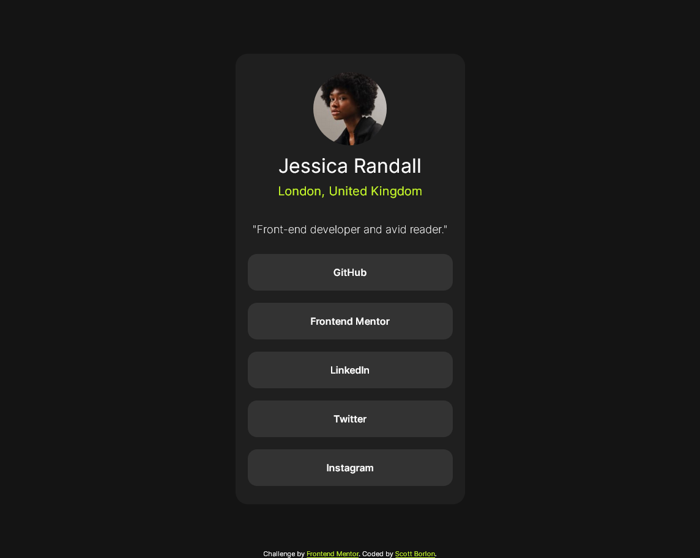

# Frontend Mentor - social links profile solution

This is a solution to the [Recipe page challenge on Frontend Mentor](https://www.frontendmentor.io/challenges/recipe-page-KiTsR8QQKm). Frontend Mentor challenges help you improve your coding skills by building realistic projects. 

## Table of contents

- [Overview](#overview)
  - [Screenshot](#screenshot)
  - [Links](#links)
- [My process](#my-process)
  - [Built with](#built-with)
- [Author](#author)
- [Acknowledgments](#acknowledgments)

## Overview

### Screenshot

### Links

- Solution URL: [solution URL](https://github.com/MeowB/social-links-profile-main)
- Live Site URL: [live site URL](https://meowb.github.io/social-links-profile-main/)

## My process

### Built with

- html
- sass

## Author

- Frontend Mentor - [@MeowB](https://www.frontendmentor.io/profile/MeowB)
